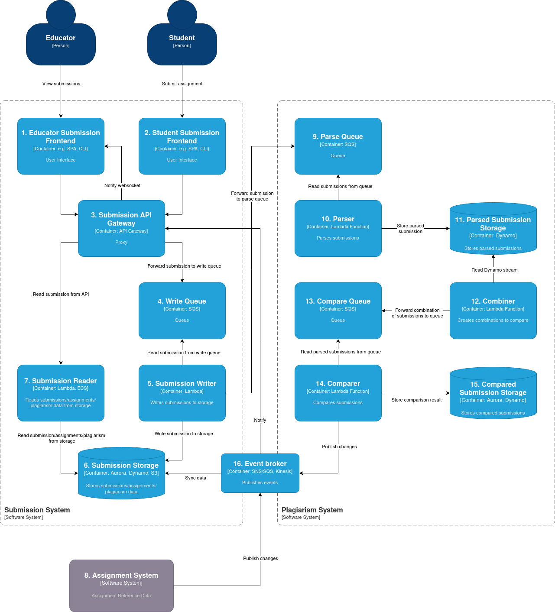

# Plagiarism Detection Design Doc

This document outlines the high-level design for the CodeGrade take-home system design assignment. It is loosely based on [design docs at Google](https://www.industrialempathy.com/posts/design-docs-at-google/), but skips a lot due to time constraints.

## Design

### Context diagram (based on the [C4 model](https://c4model.com/))

### Description

Students submit using a frontend (#2). Submissions pass through a proxy (#3) and land in a queue (#4). Submissions are read from this queue by a writer (#5) and stored in separate storage (#6). The writer forwards submissions to a queue (#9) in the Plagiarism System. A parser (#10) reads from this queue and parses submissions. It stores the result (#11) to a Dynamo database. This database publishes events in a stream, which are used by the Combiner (#12) to create combinations for comparison. These are written to a queue (#13). A comparer (#14) reads from this queue, compares and submissions, stores the result and publishes the result through the Event Broker (#16). Through this mechanism, plagiarism data is stored in the Submission System. Educators are notified by websocket (and/or e-mail) through the API Gateway.

Educators can view submission and plagiarism results through a frontend (#1). Additionally, they are notified of updates through websocket/e-mail by the API gateway.

### Assumptions 

* An external system (#8) exists that publishes assignment data to the Submission System through the Event Broker (#16)
* Educators only want to receive notifications when they have the submission frontend opened (except, perhaps, a single e-mail when all submissions have been checked for plagiarism)
* A Dynamo stream (#12) provides correct ordering and enough event info to be able to create combinations for comparison without synchronously reading/locking data
* Concurrency limit for Lambda functions is adequate
* Storing comparison (#15) results is not a good fit for Dynamo, due to its key/value nature, a managed RDBMS might be more suited. However, I am not a NoSQL guru.
* There is no heavy reading from the Submission reader (#7).  Otherwise:
    - it might be necessary to offload/aggregate data to a reporting database
    - it might be wasteful to use lambda concurrency for reading; scaling could also be achieved by ECS + Elastic Load Balancing
* Queue message size is adequate for transmitting serialized submissions (otherwise, S3 may be necessary for storing the payload)
* Monitoring and logging is in place (data can be correlated through the system and monitored in Cloudwatch or some Open Telemetry-based solution)
* The solution is designed for AWS

## Cross-cutting concerns

* Scalability is achieved through leveraging concurrent execution of compute-intensive tasks with Lambda. This facilitates performance by allowing high write throughput; processing and reading can follow suit.
* Reliablility is achieved by relying on managed and scalable AWS services such as SQS, DynamoDB, Aurora
* Error handling is achieved by monitoring succesful processing of queues in combination with a monitoring system
* Decoupling of services is achieved through an event driven approach 

## Appendix: time allocation

I spent roughly between 5 and 6 hours on this design. It is a rough estimate, because time was mostly spent in small chunks in between other obligations.

Breakdown:

- Skimmed the original [JPlag paper](https://page.mi.fu-berlin.de/prechelt/Biblio/jplagTR.pdf) for context (1 hour)
- Brainstormed a high-level approach (pure functions -> stateless -> concurrency/lambda) (1 hour)
* Worked out some caveats with regards to AWS components (e.g., SQS, DynamoDB) (1 hour)
* Drew the context diagram,  wrote this document, a little rework on the approach (3 hours)
